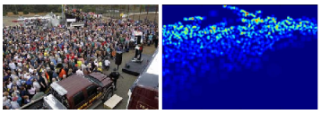

# Crowd_counting_from_scratch
This is an overview and tutorial about crowd counting. In this repository, you can learn how to estimate number of pedestrians in crowd scenes through computer vision and deep leaning.
## How to do crowd counting?
&emsp;Crowd counting has a long research history. About twenty years ago or even earlier, researchers have been interested in developing the method to count the number of pedestrians in the image automatically.  
&emsp;There are mainly three categories of methods to count pedestrians in crowd. 1)Pedestrian detector. You can use traditional HOG-based detector or deeplearning-based detector like YOLOs or RCNNs. But effect of this category of methods are seriously affected by occlusion in crowd scenes. 2)Number regression. This category of methods just capture some features from original images and use machine-learning models to map the relation between features and numbers. An improved version via deep-learning directly map the relation between original image and its numbers. Before deep-learning, regression-based methods were SOTA and researchers are focus on finding more effective features to estimate more accuracy results. But when deep-learning get popular and achieve better results, regression-based methods get less attention because it is hard to capture effective hand-crafted features. 3)Density-map. This category of methods are the mainstream methods in crowd counting nowadays. Compared with detector-based methods and regression-based methods, density-map can not only give the information of pedestrian numbers, but also can reflect the distribution of pedestrians, which can make the models to fit original images with opposite density better.
## What is density-map?
&emsp;Simply speaking, we use a gaussian kernel to simulate a head in corresponding position of the original image. After do this action for all heads in the image, we then perform normalization in matrix which is composed by all these gaussian kernels. The sample picture is as follows:  
  
&emsp;Further, there are three strategies to generate density-map.  
* 1: use the same gaussian kernel to simulate all heads. This method applies to scene without severe perspective distortion. [[fixed_kernel_code]](./generate_density_map/same_gaussian_kernel.py)  
* 2: use the perspective map(which is generated by linear regression of pedestrians' height) to generate gaussian kernels with different sizes to different heads. This method applies to fixed scene. [[perspective_kernel_code]](./generate_density_map/perspective_gaussian_kernel.py) And [[paper-zhang-CVPR2015]](https://www.ee.cuhk.edu.hk/~xgwang/papers/zhangLWYcvpr15.pdf) give detailed instruction about how to generate perspective density-map.  
* 3: use the k-nearest heads to generate gaussian kernels with different sizes to different heads. This method applies to very crowded scenes. [[k_nearset_kernel_code]](./generate_density_map/k_nearest_gaussian_kernel.py) And [[paper-MCNN-CVPR2016]](https://pdfs.semanticscholar.org/7ca4/bcfb186958bafb1bb9512c40a9c54721c9fc.pdf) give detailed instruction about how to generate k-nearest density-map.  

## DataLoader for load image and its corresponding density-map
&emsp;When finish generating density-maps, we need to program a dataloader to load image and its corresponding density-map for forward and backward propagation every batch. For images with same resolution, we can use batch_size=32 or 64 or even larger. Otherwise, we just use batch_size=1. We strongly recommend to use [torch.utils.data.Dataset](https://pytorch.org/docs/stable/data.html#torch.utils.data.Dataset) and [torch.utils.data.DataLoader](https://pytorch.org/docs/stable/data.html#torch.utils.data.DataLoader) to realize your own dataloader. An example code for how to contrust an dataloader is in [[dataloader_example_code]](./dataloader/dataloader_example.py).
## Deep-learning model for crowd counting
&emsp;For beginner, [[paper-MCNN-CVPR2016]](https://pdfs.semanticscholar.org/7ca4/bcfb186958bafb1bb9512c40a9c54721c9fc.pdf) is the most suitable model to learn crowd counting. The model is not complex and have an acceptable accuracy. [[MCNN-project]](https://github.com/svishwa/crowdcount-mcnn) provides an unoffical implemention. We also provide an easy [[MCNN_model_code]](./crowd_model/mcnn_model.py) to let you know MCNN rapidly and an easy full realization of [[MCNN-pytorch]](https://github.com/CommissarMa/MCNN-pytorch).
## Learn More
&emsp;If you want learn more about crowd counting, you can visit [[Awesome Crowd Counting]](https://github.com/gjy3035/Awesome-Crowd-Counting). It collects the papers and opposite codes in the field of crowd counting.