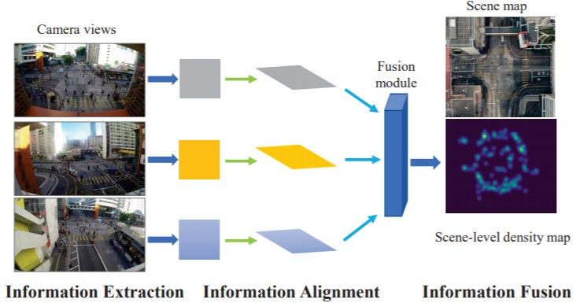

# 调研：多视角群体计数

### 动机：为什么要做多视角群体计数？  
单视角的群体计数虽然是目前的主流计数研究方向，在对应的数据集上也取得了比较不错的精度。但在实际应用中，这种方式对于巨大的场景或者宽阔的场景的实际效果较差，主要原因如下：
1. 单视角受限于视距，不能提供计数整个场景所需的足够信息。
2. 较远的人群，其分辨率较低，不易识别。
3. 行人之间存在遮挡，导致误差。  
因此，为解决这种问题，我们希望利用不重叠的多视角图像，并且希望多个视角相对分散，以至于相同目标不会一直被遮挡。来更好地估计整个场景中的行人密度分布。

### 相关文献：大家之前都是怎么做的？
+ 传统方法：
    1. **检测/跟踪**。该类方法首先对每个视角中的目标进行检测/跟踪，然后将结果投影到统一的平面进行集成得到最后的结果，比如地平面或参考视角。参考文献：[3,4,5,6]
    2. **回归**。该类方法首先对每个视角提取前景信息，然后将这些前景信息进行关联，通过回归模型得到最终的人数。参考文献：[7,8]
    3. **3D圆柱体**。该类方法致力于寻找人体在3D场景中的位置，具体的方式是：假设该人的3D位置为(x,y,z)，根据相机几何将该位置投影到对应的位置(x',y')，我们的目标就是最小化(x',y')与真实单视角中该人的位置(x_gt,y_gt)的差异。这样就能反向地得到该人的3D位置。参考文献：[9]
+ 深度学习：  
    目前主要是两篇文献[1,2]：  
    1. (MVMS) Wide-Area Crowd Countingvia Ground-Plane Density Maps and Multi-View Fusion CNNs (CVPR2019)
    2. (3DCount) 3D Crowd Counting via Multi-View Fusion with 3D Gaussian Kernels (AAAI2020)  
    + Note：两篇文章出自同一个课题组 [[链接]](http://visal.cs.cityu.edu.hk/publications/)
    。两篇文章的任务是都是多视角下的群体计数，区别在于特征融合方式以及场景密度图构建方式的不同。  

    先看第一篇文章(MVMS)：  
    该文章提出一种基于深度学习的多视角计数方法，即从每个视角中提取信息，然后融合这些信息成为一个场景级别的地平面密度图。如下图所示：
      
    方法分为三个阶段：1）信息提取，即从每个视角用CNN提取信息；2）信息对齐，即使用相机几何，将各视角信息投影到场景的地平面。3）信息融合，将投影后的信息进行融合，预测场景级别的*地平面密度图*。  
    然后遵循这个总方法，作者提出了三种具体的融合策略，比较细节，创新点也不强，不予展开。
    
    再看第二篇文章(3DCount)：  
    与MVMS不同，这篇文章最大的贡献点在于密度图建模方式上的改变——提出3D密度图来取代2D地平面密度图。相比2D地平面密度图，3D密度图能够提供z轴(高度)上的信息，并仍然保留了2D密度图的特性，即密度图的积分代表人数，提供了3D空间上的密度分布。为了对3D密度图进行预测，网络框架如下图所示：
      
    文章使用了3D特征融合。比起2D融合，3D融合能够提取更多的z轴上的信息（人体高度信息），能够帮助解决多视角下的尺度变换。此外，文章探索了投影一致性(Proj-consistency measure)，即3D预测投影到各个视角的结果应该是与直接在2D视角的真实人数一致的，用这个loss来帮助训练。

## 数据集
一共有3个数据集：
+ 传统数据集：PETS2009和DukeMTMC
+ 深度数据集：City Street
这三个数据集的对比图如下：
  

数据集 | 分辨率 | 视角数量 | 训练数据/测试数据 | 人数范围   
:-: | :-: | :-: | :-: | :-:
PETS2009 | 768×576 | 3 | 1105/794 | 20-40 |
DukeMTMC | 1920×1080 | 4 | 700/289 | 10-30 |
City Street | 2704×1520 | 3 | 300/200 | 70-150 |

总的来说，传统数据集对这个任务适用性一般，新的深度数据集适用该任务，但与任务的复杂度相比，数据量仍然显得非常小，未来肯定会有大数据集进行跟进。

## 未来展望
  
图中展示了不同数据集下的3D密度图。显然，3D密度图相比2D密度图又多提供了一维的空间信息，对整个场景的密度估计也会更加精确，而且是全场景的，不是单图的（比如一个场景装了3个摄像头，传回来3个人数，由于遮挡、透视等因素可能差异很大，那么整个场景中的人数是多少呢？多视角计数就能解决这个问题）。  

那么我们可以怎么接下去做呢？目前这个新提出的数据集只有1个场景，还是单场景下的预测，所以还处于demo阶段，远不能实际应用。要真正能够实用，还需要大量跨场景数据的采集、标注等工作。以及如何进一步优化3D密度图的建模等等。

## Reference
1. Wide-Area Crowd Countingvia Ground-Plane Density Maps and Multi-View Fusion CNNs (CVPR2019)
2. 3D Crowd Counting via Multi-View Fusion with 3D Gaussian Kernels (AAAI2020)
3. People counting in crowded and outdoor scenes using a hybrid multi-camera approach (ArXiv,2017)
4. People counting across multiple cameras for intelligent video surveillance. In IEEE Ninth International Conference on Advanced Video and Signal-Based Surveillance (AVSS,2012)
5. A reliable people counting system via multiple cameras. ACM Transactions on Intelligent Systems and Technology (TIST,2012)
6. People counting by learning their appearance in a multi-view camera environment (Pattern Recognition Letters, 2014)
7. Scene invariant multi camera crowd counting (Pattern Recognition Letters, 2014)
8. Cross-camera knowledge transfer for multiview people counting (TIP, 2014)
9. Crowd detection with a multiview sampler (ECCV,2010)
